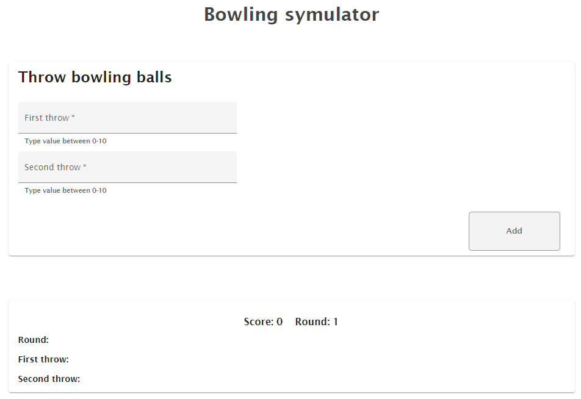
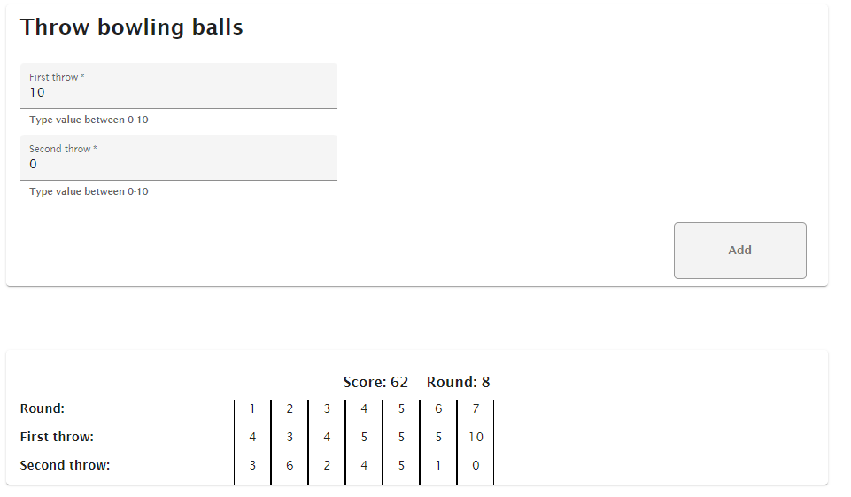

# Bowling Simulator

## Cloning repo

Switch to develop branch and clone repo to the folder that you want

## Development server

Run `ng serve` for a dev server. Navigate to `http://localhost:4200/`. The app will automatically reload if you change any of the source files.

## Rules of the game

A game consists of ten frames. Frame 1-9 are composed of two rolls.
Frame 10 can be composed of up to three rolls depending on if the first rolls in the frame is a strike or a spare.

Each frame can have one of three marks:

- Strike: all 10 pins where knocked down with the first roll.
- Spare: all 10 pins where knocked down using two rolls.
- Open: some pins where left standing after the frame was completed.

## View of the application

Application start screen

To play the game the user needs to put two values to the input fields and then press button named "Add".
After that the throw will be send to the store and the result will be visibile below.

